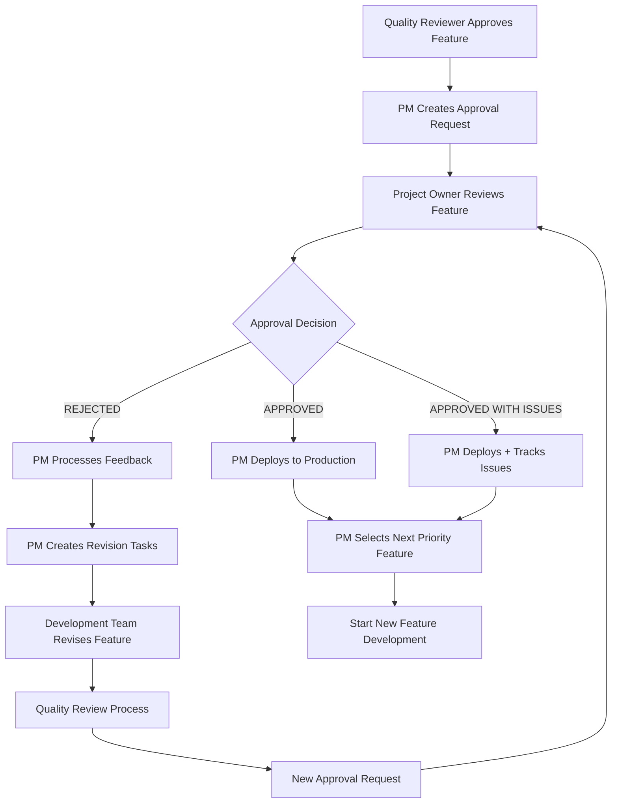

# Feature Approval Workflow

## 🎯 PURPOSE
Systematic workflow for project owner feedback, feature approval/rejection, and automatic next feature prioritization to ensure continuous delivery and quality improvement.

## 🔄 WORKFLOW OVERVIEW



## 📋 DETAILED WORKFLOW STAGES

### Stage 1: Feature Delivery Notification

#### PM Agent Actions on Quality Reviewer Approval
```python
async def handle_quality_reviewer_approval(self, contract: Dict[str, Any]) -> None:
    """Handle feature approval from Quality Reviewer."""
    
    # 1. Extract delivery information
    story_id = contract["story_id"]
    feature_data = contract["input_requirements"]["required_data"]
    quality_metrics = feature_data["quality_analysis"]
    
    # 2. Create approval request issue
    approval_issue = await self._create_approval_request_issue(
        story_id=story_id,
        feature_data=feature_data,
        quality_metrics=quality_metrics
    )
    
    # 3. Notify project owner
    await self._notify_project_owner_for_approval(
        approval_issue_number=approval_issue["number"],
        story_id=story_id,
        feature_summary=feature_data["feature_summary"]
    )
    
    # 4. Set feature status to "awaiting_approval"
    await self._update_feature_status(story_id, "awaiting_approval")
    
    # 5. Schedule approval reminder (48 hours)
    await self._schedule_approval_reminder(approval_issue["number"])
```

#### Approval Request Creation Template
```python
def _create_approval_request_issue(self, story_id: str, feature_data: Dict, quality_metrics: Dict) -> Dict:
    """Create GitHub issue for project owner approval."""
    
    approval_issue = {
        "title": f"[APPROVAL] {feature_data['feature_title']} - {story_id}",
        "body": self._generate_approval_request_body(story_id, feature_data, quality_metrics),
        "labels": ["feature-approval", "awaiting-decision", f"story-{story_id}"],
        "assignees": [self._get_project_owner()],
        "milestone": self._get_current_sprint_milestone()
    }
    
    return approval_issue

def _generate_approval_request_body(self, story_id: str, feature_data: Dict, quality_metrics: Dict) -> str:
    """Generate approval request body with all necessary information."""
    
    template = """
# 🎯 Feature Ready for Approval - {story_id}

Hej {project_owner}!

Feature **{feature_title}** has been completed and is ready for your review and approval.

## 📊 Delivery Summary
- **Story ID:** {story_id}
- **Completion Date:** {completion_date}
- **Overall Quality Score:** {quality_score}/100
- **Development Time:** {development_time}
- **Test Coverage:** {test_coverage}%

## 🎮 Feature Access
- **Staging URL:** {staging_url}
- **Login Credentials:** {staging_credentials}
- **Demo Scenario:** {demo_scenario}

## ✅ Original Acceptance Criteria
{original_acceptance_criteria}

## 📈 Quality Metrics Achieved
- **Performance:** API {api_response_time}ms, Lighthouse {lighthouse_score}/100
- **Accessibility:** WCAG AA {accessibility_score}% compliant  
- **User Experience:** {ux_score}/5.0 for Anna persona
- **DNA Compliance:** {dna_compliance_score}/5.0

## 🔄 How to Test
1. Access the staging environment using the URL above
2. Follow the demo scenario to test core functionality
3. Verify each acceptance criterion is met
4. Test with Anna persona workflow in mind

## ✅ Approval Process
Please create an **Approval Issue** using our template to provide your decision:
- Use template: [Feature Approval](.github/ISSUE_TEMPLATE/feature_approval.md)
- Reference this delivery with Story ID: {story_id}
- Provide detailed feedback if rejected

## ⏱️ Response Timeline
- **Target Response:** Within 48 hours
- **Automatic Reminder:** After 24 hours if no response
- **Escalation:** After 72 hours to project stakeholders

Tack så mycket!

Mvh,
DigiNativa AI Team (Project Manager)
    """.format(
        story_id=story_id,
        project_owner=self._get_project_owner_name(),
        feature_title=feature_data["feature_title"],
        completion_date=datetime.now().strftime("%Y-%m-%d %H:%M"),
        quality_score=quality_metrics["overall_score"],
        development_time=feature_data.get("development_time", "N/A"),
        test_coverage=quality_metrics.get("test_coverage", "N/A"),
        staging_url=self._generate_staging_url(story_id),
        staging_credentials=self._get_staging_credentials(),
        demo_scenario=feature_data.get("demo_scenario", "Standard user workflow"),
        original_acceptance_criteria=self._format_acceptance_criteria(feature_data["acceptance_criteria"]),
        api_response_time=quality_metrics.get("api_response_time", "N/A"),
        lighthouse_score=quality_metrics.get("lighthouse_score", "N/A"),
        accessibility_score=quality_metrics.get("accessibility_score", "N/A"),
        ux_score=quality_metrics.get("ux_score", "N/A"),
        dna_compliance_score=quality_metrics.get("dna_compliance_score", "N/A")
    )
    
    return template
```

### Stage 2: Project Owner Review Process

#### Approval Decision Processing
```python
async def monitor_approval_decisions(self) -> None:
    """Monitor for new approval decisions from project owners."""
    
    # Fetch all approval issues
    approval_issues = await self.github_integration.fetch_approval_issues()
    
    for issue in approval_issues:
        if self._is_new_approval_decision(issue):
            await self._process_approval_decision(issue)

async def _process_approval_decision(self, approval_issue: Dict) -> None:
    """Process project owner approval decision."""
    
    # Parse approval decision
    decision = self._parse_approval_decision(approval_issue["body"])
    story_id = self._extract_story_id(approval_issue["title"])
    
    if decision["status"] == "APPROVED":
        await self._handle_feature_approval(story_id, decision)
    elif decision["status"] == "REJECTED":
        await self._handle_feature_rejection(story_id, decision)
    elif decision["status"] == "APPROVED_WITH_ISSUES":
        await self._handle_conditional_approval(story_id, decision)

def _parse_approval_decision(self, issue_body: str) -> Dict[str, Any]:
    """Parse approval decision from issue body."""
    
    # Extract decision type
    if "- [x] **APPROVED**" in issue_body:
        status = "APPROVED"
    elif "- [x] **REJECTED**" in issue_body:
        status = "REJECTED"
    elif "- [x] **APPROVED WITH MINOR ISSUES**" in issue_body:
        status = "APPROVED_WITH_ISSUES"
    else:
        status = "PENDING"
    
    # Extract feedback details
    critical_issues = self._extract_critical_issues(issue_body)
    minor_issues = self._extract_minor_issues(issue_body)
    acceptance_criteria_review = self._extract_acceptance_review(issue_body)
    next_feature_priority = self._extract_next_priority(issue_body)
    
    return {
        "status": status,
        "critical_issues": critical_issues,
        "minor_issues": minor_issues,
        "acceptance_criteria_review": acceptance_criteria_review,
        "next_feature_priority": next_feature_priority,
        "feedback_timestamp": datetime.now().isoformat()
    }
```

### Stage 3: Feedback Processing and Action

#### Feature Approval Handler
```python
async def _handle_feature_approval(self, story_id: str, decision: Dict) -> None:
    """Handle approved feature."""
    
    # 1. Deploy to production
    deployment_result = await self._deploy_to_production(story_id)
    
    # 2. Update feature status
    await self._update_feature_status(story_id, "deployed")
    
    # 3. Send confirmation
    await self._send_approval_confirmation(story_id, deployment_result)
    
    # 4. Start next priority feature
    await self._start_next_priority_feature(decision.get("next_feature_priority"))
    
    # 5. Schedule follow-up review
    await self._schedule_post_deployment_review(story_id, days=14)

async def _handle_feature_rejection(self, story_id: str, decision: Dict) -> None:
    """Handle rejected feature with feedback processing."""
    
    # 1. Analyze feedback
    feedback_analysis = await self._analyze_rejection_feedback(decision)
    
    # 2. Create revision plan
    revision_plan = await self._create_revision_plan(story_id, feedback_analysis)
    
    # 3. Break down into development tasks
    revision_tasks = await self._create_revision_tasks(story_id, revision_plan)
    
    # 4. Estimate revision timeline
    revision_timeline = await self._estimate_revision_timeline(revision_tasks)
    
    # 5. Send revision acknowledgment
    await self._send_revision_acknowledgment(story_id, revision_plan, revision_timeline)
    
    # 6. Create new development contract for revision
    revision_contract = await self._create_revision_contract(story_id, revision_tasks)
    
    # 7. Hand off to appropriate agent for revision
    await self._handoff_revision_to_agent(revision_contract)

async def _analyze_rejection_feedback(self, decision: Dict) -> Dict[str, Any]:
    """Analyze rejection feedback to create actionable development tasks."""
    
    feedback_analysis = {
        "critical_issues_count": len(decision["critical_issues"]),
        "minor_issues_count": len(decision["minor_issues"]),
        "failed_acceptance_criteria": self._identify_failed_criteria(decision["acceptance_criteria_review"]),
        "development_areas": [],
        "design_areas": [],
        "testing_areas": []
    }
    
    # Categorize issues by development area
    for issue in decision["critical_issues"]:
        category = self._categorize_issue(issue)
        feedback_analysis[f"{category}_areas"].append({
            "issue": issue,
            "priority": "critical",
            "estimated_effort": self._estimate_issue_effort(issue)
        })
    
    return feedback_analysis

async def _create_revision_plan(self, story_id: str, feedback_analysis: Dict) -> Dict[str, Any]:
    """Create comprehensive revision plan based on feedback."""
    
    revision_plan = {
        "story_id": f"{story_id}-REV-001",
        "original_story_id": story_id,
        "revision_type": "feedback_based",
        "priority_order": [],
        "development_phases": [],
        "quality_gates": [],
        "timeline_estimate": None
    }
    
    # Create development phases based on feedback
    if feedback_analysis["design_areas"]:
        revision_plan["development_phases"].append({
            "phase": "design_revision",
            "agent": "game_designer",
            "tasks": feedback_analysis["design_areas"],
            "estimated_duration": self._estimate_phase_duration("design", feedback_analysis["design_areas"])
        })
    
    if feedback_analysis["development_areas"]:
        revision_plan["development_phases"].append({
            "phase": "development_revision", 
            "agent": "developer",
            "tasks": feedback_analysis["development_areas"],
            "estimated_duration": self._estimate_phase_duration("development", feedback_analysis["development_areas"])
        })
    
    if feedback_analysis["testing_areas"]:
        revision_plan["development_phases"].append({
            "phase": "testing_revision",
            "agent": "test_engineer", 
            "tasks": feedback_analysis["testing_areas"],
            "estimated_duration": self._estimate_phase_duration("testing", feedback_analysis["testing_areas"])
        })
    
    # Calculate total timeline
    total_duration = sum(phase["estimated_duration"] for phase in revision_plan["development_phases"])
    revision_plan["timeline_estimate"] = {
        "total_hours": total_duration,
        "estimated_delivery": (datetime.now() + timedelta(hours=total_duration)).isoformat()
    }
    
    return revision_plan
```

### Stage 4: Priority Queue Management

#### Next Feature Selection Logic
```python
async def _start_next_priority_feature(self, suggested_priority: Optional[str] = None) -> None:
    """Start next highest priority feature based on queue and dependencies."""
    
    # 1. Get priority queue
    priority_queue = await self._get_feature_priority_queue()
    
    # 2. Consider project owner suggestion
    if suggested_priority:
        priority_queue = self._adjust_queue_for_suggestion(priority_queue, suggested_priority)
    
    # 3. Check dependencies
    available_features = await self._filter_by_dependencies(priority_queue)
    
    # 4. Select next feature
    if available_features:
        next_feature = available_features[0]
        await self._start_feature_development(next_feature["story_id"])
    else:
        await self._handle_no_available_features()

async def _get_feature_priority_queue(self) -> List[Dict[str, Any]]:
    """Get current feature priority queue."""
    
    # Fetch all open feature requests
    open_features = await self.github_integration.fetch_new_feature_requests()
    
    # Filter out features already in progress or completed
    pending_features = [f for f in open_features if f["status"] == "pending"]
    
    # Sort by priority and creation date
    priority_order = {"critical": 0, "high": 1, "medium": 2, "low": 3}
    
    sorted_features = sorted(pending_features, key=lambda x: (
        priority_order.get(x["priority_level"], 4),
        x["created_at"]
    ))
    
    return sorted_features

async def _filter_by_dependencies(self, features: List[Dict]) -> List[Dict]:
    """Filter features that have no blocking dependencies."""
    
    available_features = []
    
    for feature in features:
        dependencies = await self._check_feature_dependencies(feature["story_id"])
        
        if not dependencies["blocking_dependencies"]:
            available_features.append(feature)
        else:
            # Log dependency blocking
            await self._log_dependency_blocking(feature["story_id"], dependencies)
    
    return available_features

async def _check_feature_dependencies(self, story_id: str) -> Dict[str, Any]:
    """Check if feature has any blocking dependencies."""
    
    # Parse feature requirements for dependencies
    feature_data = await self._get_feature_data(story_id)
    
    dependencies = {
        "blocking_dependencies": [],
        "soft_dependencies": [],
        "technical_dependencies": []
    }
    
    # Check for explicit dependencies in feature description
    dependency_patterns = [
        r"depends on (\w+-\w+-\d+)",
        r"requires feature (\w+-\w+-\d+)",
        r"blocked by (\w+-\w+-\d+)"
    ]
    
    for pattern in dependency_patterns:
        matches = re.findall(pattern, feature_data["description"], re.IGNORECASE)
        for match in matches:
            dep_status = await self._get_dependency_status(match)
            if dep_status != "completed":
                dependencies["blocking_dependencies"].append({
                    "dependency_id": match,
                    "status": dep_status,
                    "blocking": True
                })
    
    return dependencies
```

### Stage 5: Communication and Tracking

#### Automated Communication Templates
```python
async def _send_approval_confirmation(self, story_id: str, deployment_result: Dict) -> None:
    """Send confirmation of approved feature deployment."""
    
    confirmation_message = f"""
# ✅ Feature Deployed Successfully - {story_id}

Tack för ditt godkännande! Feature has been deployed to production.

## 🚀 Deployment Details
- **Production URL:** {deployment_result['production_url']}
- **Deployment Time:** {deployment_result['deployment_timestamp']}
- **Version:** {deployment_result['version']}

## 📊 Next Steps
- Starting work on next priority feature: {deployment_result['next_feature_id']}
- Post-deployment monitoring active for 14 days
- Follow-up review scheduled: {deployment_result['follow_up_date']}

Mvh,
DigiNativa AI Team (Project Manager)
    """
    
    await self._send_notification(story_id, confirmation_message)

async def _send_revision_acknowledgment(self, story_id: str, revision_plan: Dict, timeline: Dict) -> None:
    """Send acknowledgment of rejection with revision plan."""
    
    acknowledgment_message = f"""
# 🔄 Feedback Received - Revision Plan Created - {story_id}

Tack för din detaljerade feedback! I have analyzed your feedback and created a revision plan.

## 📋 Revision Summary
- **Critical Issues:** {len(revision_plan['critical_issues'])}
- **Minor Issues:** {len(revision_plan['minor_issues'])}
- **Development Phases:** {len(revision_plan['development_phases'])}

## ⏱️ Revised Timeline
- **Estimated Completion:** {timeline['estimated_delivery']}
- **Total Effort:** {timeline['total_hours']} hours
- **Phases:** {', '.join(phase['phase'] for phase in revision_plan['development_phases'])}

## 🔄 Development Process
{self._format_revision_phases(revision_plan['development_phases'])}

## 📞 Next Communication
- Progress updates: Every 24 hours
- Revised feature ready: {timeline['estimated_delivery']}
- New approval request: Automatically created when ready

Your feedback helps us deliver better solutions for Swedish municipalities!

Mvh,
DigiNativa AI Team (Project Manager)
    """
    
    await self._send_notification(story_id, acknowledgment_message)
```

## 📊 SUCCESS METRICS

### Approval Workflow Metrics
- **Approval Rate:** Target >80% first-time approval
- **Feedback Response Time:** <4 hours acknowledgment, <24 hours revision plan
- **Revision Success Rate:** >95% approval after feedback integration
- **Next Feature Start Time:** <8 hours after approval

### Quality Improvement Metrics
- **Feedback Integration Accuracy:** >90% of feedback items addressed in revision
- **Client Satisfaction:** >4.5/5.0 rating for revision quality
- **Development Velocity:** Consistent feature delivery despite revision cycles
- **Feature Quality Trend:** Improving first-time approval rate over time

---

**This workflow ensures continuous feedback integration and automatic prioritization, creating a self-improving AI team that learns from project owner feedback.**